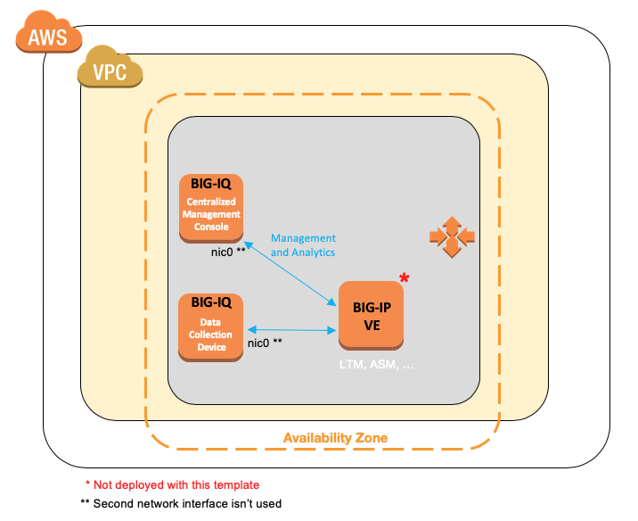

## Prerequisites

To deploy the Terraform example of the BIG-IQ QuickStart BIG-IQ trial licenses are required.  To do this,
go to [F5 Trial](https://f5.com/products/trials/product-trials) and;

   * Select **BIG-IP VE and BIG-IQ**

To deploy within AWS using Terraform a valid AWS Subscription is also required, select 
Subscribe and accept the Terms and Conditions for these F5 products:

   * [F5 BIG-IQ Virtual Edition - (BYOL)](https://aws.amazon.com/marketplace/pp/B00KIZG6KA)

***Optional***

If there is the desire to install the full demo stack the additional tools/accounts are suggested:

* [Terraform CLI](https://www.terraform.io/docs/cli-index.html)
* [git](https://git-scm.com/)
* [AWS CLI](https://aws.amazon.com/cli/) access.
* [AWS Access Credentials](https://docs.aws.amazon.com/general/latest/gr/aws-security-credentials.html)

## Installation 

This section covers the configuration for the Terraform refactored deployment [BIG-IQ Centralized Management Trial Quick Start - AWS](https://github.com/f5devcentral/f5-big-iq-trial-quick-start/tree/8.0.0.1/aws) 
that is available as a Cloud Formation Template (CFT).

The deployment architecture is deployed as indicated in the diagram below;

**Note:** This template uses BIG-IQ 8.0.0.1




1. Open the [EC2 console](https://console.aws.amazon.com/ec2/v2/home) and wait until the BIG-IQ instances are fully deployed.

   * Instance State: running
   * Status Checks: 2/2 checks passed

2. Use admin user and your AWS SSH key to SSH into the BIG-IQ DCD instance, then execute the following commands:

   ```
   # ssh ~/.ssh/privatekey.pem admin@1.2.3.4
   (tmos)# bash
   # /config/cloud/setup-dcd.sh
   ```

   * When prompted, enter a password for BIG-IQ. You will use this same password again on the BIG-IQ CM instance. [Details on prohibited characters](https://support.f5.com/csp/article/K2873).
   * Let the scripts finish before moving to the next step.

3. Use admin user and your AWS SSH key to SSH into the BIG-IQ CM instance, then execute the following commands:

   ```
   # ssh ~/.ssh/privatekey.pem admin@1.2.3.5
   (tmos)# bash
   # /config/cloud/setup-cm.sh
   ```

   * The password must match the password you used on the BIG-IQ DCD instance in the previous step.
   * Let the scripts finish before moving to the next step.

4. Open BIG-IQ CM in a web browser by using the public IP address with https, for example: ``https://<public_ip>``

   * Use the username `admin`.
   * Click the **Devices** tab > **BIG-IP DEVICES**. Click on **Add Device(s)**.

5. Start managing BIG-IP devices from BIG-IQ, go to the [BIG-IQ Knowledge Center](https://techdocs.f5.com/en-us/bigiq-7-1-0/managing-big-ip-devices-from-big-iq/device-discovery-and-basic-management.html).

    * Manage your existing BIG-IP(s) on premise (need VPN/AWS Direct Connect) or in the cloud.
    * Don't have BIG-IP yet? deploy a VE in AWS from the [marketplace](https://clouddocs.f5.com/cloud/public/v1/aws_index.html) or using [BIG-IQ](https://techdocs.f5.com/en-us/bigiq-7-0-0/big-iq-centralized-management-ve-create-aws-image.html).

For more information, go to [the BIG-IQ Centralized Management Knowledge Center](https://support.f5.com/csp/knowledge-center/software/BIG-IQ?module=BIG-IQ%20Centralized%20Management&version=8.0.0).

#### Tear Down Instructions


#### Troubleshooting


1.	In the BIG-IQ UI, check the BIG-IQ license on the Console Node and Data Collection Device (**System** > **THIS DEVICE** > **Licensing**)..
2.	In the BIG-IQ CLI, check the following logs: /var/log/setup.log, /var/log/restjavad.0.log.
3.	In AWS Marketplace, ensure you have subscribed and accepted the terms for F5 products.
4.	In AWS IAM Console, confirm the Access Key has the necessary permissions.
5.  If you encounter *ModuleNotLicensed:LICENSE INOPERATIVE:Standalone* on the DCD CLI, it can be ignored (when using skipLicense:true).